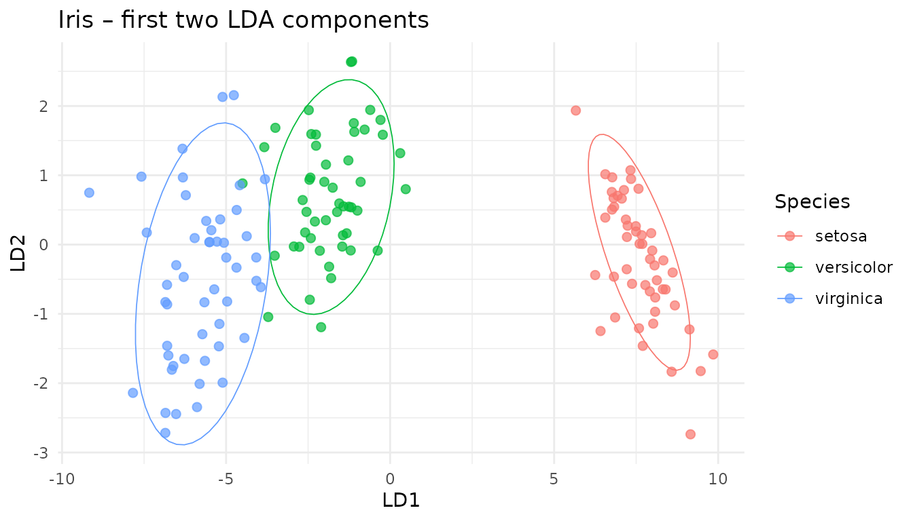
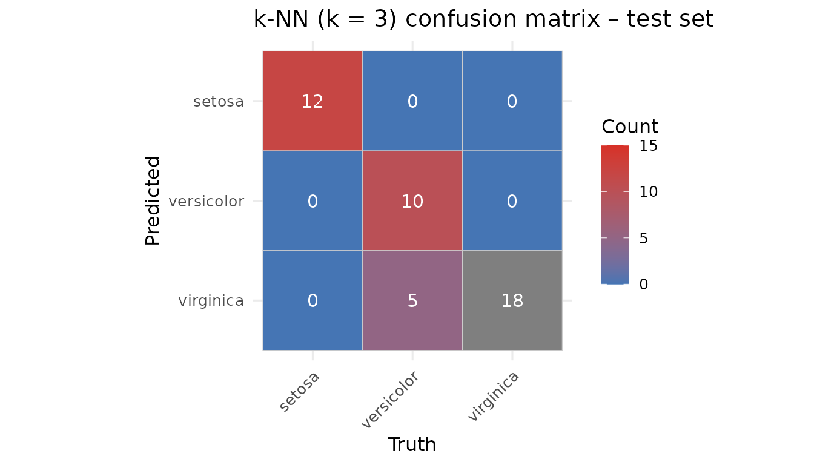

# Classifying in latent space: k-NN & Random-Forest wrappers

## 1. Why classify after projection?

Once a dimensionality-reduction model (PCA, PLS, CCA, …) is fitted,
every new sample can be projected into the low-dimensional latent space.
Running a classifier there – instead of on thousands of noisy raw
variables – yields

- fewer parameters & smaller models,
- immunity to collinearity,
- freedom to use partial data (ROI, missing sensors),
- a clean separation between unsupervised decomposition and supervised
  prediction.

The
[`classifier()`](https://bbuchsbaum.github.io/multivarious/reference/classifier.md)
S3 family supplied by `multiblock` provides that glue: you hand it any
projector (or `multiblock_biprojector`, `discriminant_projector`, …)
plus class labels → it returns a ready predictor object.

## 2. Iris demo – LDA → `discriminant_projector` → k-NN

``` r
data(iris)
X   <- as.matrix(iris[, 1:4])
grp <- iris$Species

# Fit classical Linear DA and wrap it
if (!requireNamespace("MASS", quietly = TRUE)) {
  stop("MASS package required for LDA example")
}


# 1. Define and fit the pre-processing step using the training data
preproc_fitted <- fit(center(), X)
# 2. Transform the data
Xp <- transform(preproc_fitted, X)

# Assuming discriminant_projector, prep, center, scores are available
lda_fit <- MASS::lda(X, grouping = grp)


disc_proj <- multivarious::discriminant_projector(
  v      = lda_fit$scaling,                 # loadings (p × d)
  s      = Xp %*% lda_fit$scaling,           # scores   (n × d)
  sdev   = lda_fit$svd,                     # singular values
  labels = grp,
  preproc = preproc_fitted            # Pass the fitted pre-processor
)
print(disc_proj)
#> Projector object:
#>   Input dimension: 4
#>   Output dimension: 2
#>   With pre-processing:
#> A finalized pre-processing pipeline:
#>  Step 1: center
#> Label counts: 
#>     setosa versicolor  virginica 
#>         50         50         50
```

### 2.1 Visualise the latent space

``` r
scores_df <- as_tibble(scores(disc_proj)[, 1:2],
                       .name_repair = ~ c("LD1","LD2"))
scores_df <- mutate(scores_df, Species = iris$Species)

ggplot(scores_df, aes(LD1, LD2, colour = Species)) +
  geom_point(size = 2, alpha = .7) +
  stat_ellipse(level = .9, linewidth = .3) +
  theme_minimal() +
  ggtitle("Iris – first two LDA components")
```



### 2.2 Build a k-NN classifier on the latent scores

``` r
set.seed(42)
train_id <- sample(seq_len(nrow(X)), size = 0.7*nrow(X))
test_id  <- setdiff(seq_len(nrow(X)), train_id)

# Assuming classifier function is available
clf_knn <- multivarious::classifier(
  x       = disc_proj,
  labels  = grp[train_id],
  new_data= X[train_id, ],  # Use training data to get reference scores
  knn     = 3
)
print(clf_knn)
#> k-NN Classifier object:
#>   k-NN Neighbors (k): 3 
#>   Number of Training Samples: 150 
#>   Number of Classes: 3 
#>   Underlying Projector Details: 
#>      Projector object:
#>        Input dimension: 4
#>        Output dimension: 2
#>        With pre-processing:
#>      A finalized pre-processing pipeline:
#>       Step 1: center
#>      Label counts: 
#>          setosa versicolor  virginica 
#>              50         50         50
```

### 2.3 Predict and evaluate

``` r
pred_knn <- predict(clf_knn, new_data = X[test_id, ],
                    metric = "cosine", prob_type = "knn_proportion")

head(pred_knn$prob, 3)
#>      setosa versicolor virginica
#> [1,]      1          0         0
#> [2,]      1          0         0
#> [3,]      1          0         0
print(paste("Overall Accuracy:", mean(pred_knn$class == grp[test_id])))
#> [1] "Overall Accuracy: 0.888888888888889"

# Assuming rank_score and topk are available
rk  <- rank_score(pred_knn$prob, grp[test_id])
tk2 <- topk      (pred_knn$prob, grp[test_id], k = 2)

tibble(
  prank_mean = mean(rk$prank),
  top2_acc   = mean(tk2$topk)
)
#> # A tibble: 1 × 2
#>   prank_mean top2_acc
#>        <dbl>    <dbl>
#> 1      0.278        1
```

### 2.4 Confusion-matrix on the test set

``` r
cm <- table(
  Truth     = grp[test_id],
  Predicted = pred_knn$class
)

# Heat-map
cm_df <- as.data.frame(cm)
ggplot(cm_df, aes(Truth, Predicted, fill = Freq)) +
  geom_tile(colour = "grey80") +
  geom_text(aes(label = Freq), colour = "white", size = 4) +
  scale_fill_gradient(low = "#4575b4", high = "#d73027", name="Count", limits = c(0, 15)) +
  scale_y_discrete(limits = rev(levels(cm_df$Predicted))) +
  theme_minimal(base_size = 12) + coord_equal() +
  ggtitle("k-NN (k = 3) confusion matrix – test set") +
  theme(axis.text.x = element_text(angle = 45, hjust = 1))
```



``` r


# Pretty table as well
knitr::kable(cm, caption = "Confusion matrix (counts)")
```

|            | setosa | versicolor | virginica |
|:-----------|-------:|-----------:|----------:|
| setosa     |     12 |          0 |         0 |
| versicolor |      0 |         10 |         5 |
| virginica  |      0 |          0 |        18 |

Confusion matrix (counts)

## 3. Random-Forest on the same latent space

``` r
# Check if randomForest is installed
if (requireNamespace("randomForest", quietly = TRUE)) {

  # Assuming rf_classifier.projector method is available
  rf_clf <- rf_classifier( # Using the generic here
    x       = disc_proj,
    labels  = grp[train_id],
    # Pass scores directly if method requires it, or let it call scores(x)
    scores  = scores(disc_proj)[train_id, ]
  )

  pred_rf <- predict(rf_clf, new_data = X[test_id, ])
  print(paste("RF Accuracy:", mean(pred_rf$class == grp[test_id])))
} else {
  cat("randomForest package not installed. Skipping RF example.\n")
}
#> [1] "RF Accuracy: 0.977777777777778"
```

The RF sees exactly three input variables (the LDA components) – that
keeps trees shallow and speeds-up training.

## 4. Partial-feature prediction: sepal block only

Assume that in deployment we measure only Sepal variables (cols 1–2). A
partial projection keeps the classifier happy:

``` r
sepal_cols <- 1:2

# Create a classifier using reference scores from Sepal columns only
clf_knn_sepal <- multivarious::classifier(
  x       = disc_proj,
  labels  = grp[train_id],
  new_data= X[train_id, sepal_cols],  # Use training data subset
  colind  = sepal_cols,             # Indicate which columns were used
  knn     = 3
)

# Predict using the dedicated sepal classifier
pred_sepal <- predict(
  clf_knn_sepal,                  # Use the sepal-specific classifier
  new_data = X[test_id, sepal_cols]
  # No need for colind here as clf_knn_sepal expects sepal data
)

print(paste("Accuracy (Sepal only):", mean(pred_sepal$class == grp[test_id])))
#> [1] "Accuracy (Sepal only): 0.333333333333333"
```

Accuracy drops a bit – as expected when using fewer features.

## 5. Which component block matters most?

[`feature_importance()`](https://bbuchsbaum.github.io/multivarious/reference/feature_importance.md)
can rank variable groups via a simple “leave-block-out” score drop.

``` r
blocks <- list(
  Sepal = 1:2,
  Petal = 3:4
)

# Assuming feature_importance is available
fi <- feature_importance(
  clf_knn,
  new_data  = X[test_id, ],
  true_labels = grp[test_id], # Pass the correct test set labels
  blocks    = blocks,
  fun       = rank_score, # Use rank_score as the performance metric
  fun_direction = "lower_is_better",
  approach  = "marginal" # Calculate marginal drop when block is removed
)
print(fi)
#>   block importance
#> 2   3,4 0.25555556
#> 1   1,2 0.06111111
```
