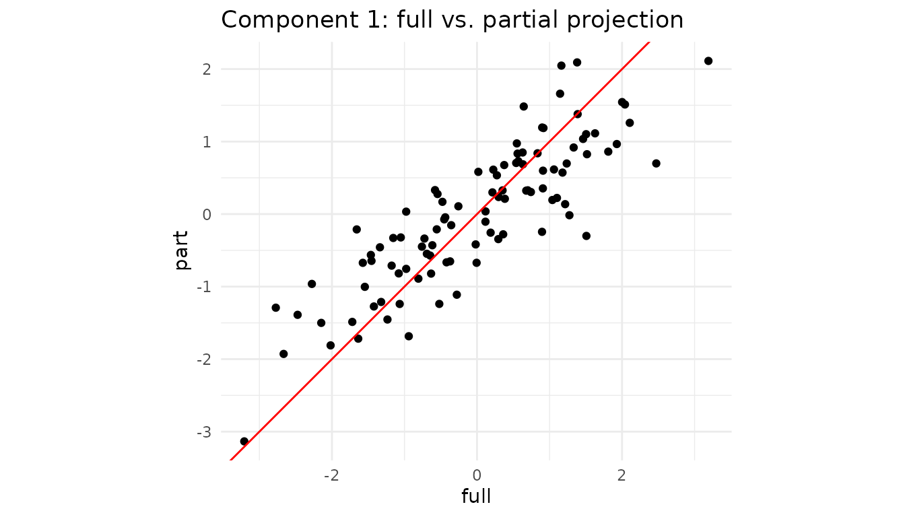
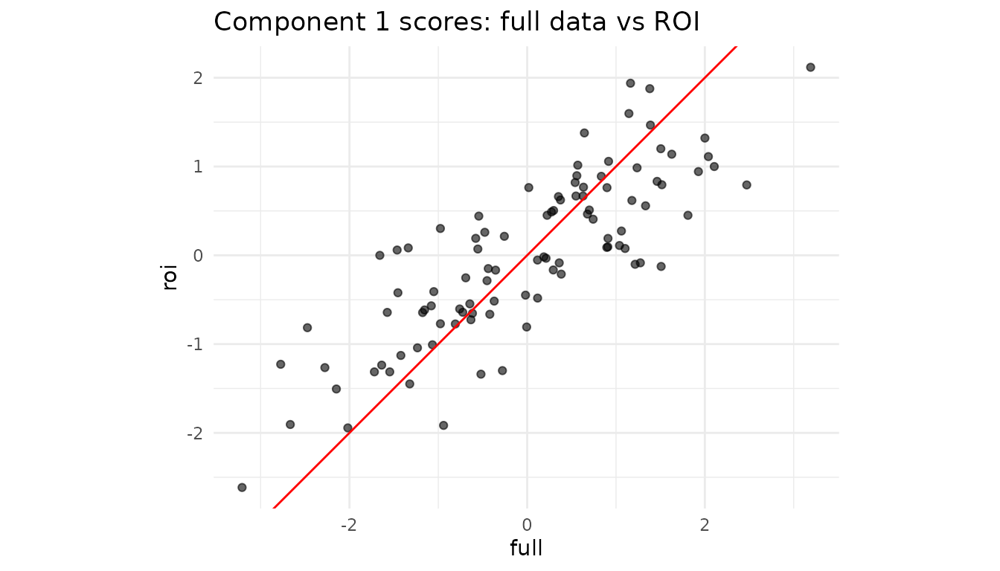

# Partial projection: working with incomplete feature sets

## 1. Why partial projection?

Assume you trained a dimensionality-reduction model (PCA, PLS …) on p
variables but, at prediction time,

- one sensor is broken,
- a block of variables is too expensive to measure,
- you need a quick first pass while the “heavy” data arrive later.

You still want the latent scores in the same component space, so
downstream models, dashboards, alarms, … keep running.

That’s exactly what

    partial_project(model, new_data_subset, colind = which.columns)

does:

`new_data_subset` (n × q) ─► project into latent space (n × k)

with q ≤ p. If the loading vectors are orthonormal this is a simple dot
product; otherwise a ridge-regularised least-squares solve is used.

------------------------------------------------------------------------

## 2. Walk-through with a toy PCA

``` r
set.seed(1)
n  <- 100
p  <- 8
X  <- matrix(rnorm(n * p), n, p)

# Fit a centred 3-component PCA (via SVD)
# Manually center the data and create fitted preprocessor
Xc <- scale(X, center = TRUE, scale = FALSE)
svd_res <- svd(Xc, nu = 0, nv = 3)

# Create a fitted centering preprocessor
preproc_fitted <- fit(center(), X)

pca <- bi_projector(
  v     = svd_res$v,
  s     = Xc %*% svd_res$v,
  sdev  = svd_res$d[1:3] / sqrt(n-1), # Correct scaling for sdev
  preproc = preproc_fitted
)
```

### 2.1 Normal projection (all variables)

``` r
scores_full <- project(pca, X)        # n × 3
head(round(scores_full, 2))
#>       [,1]  [,2]  [,3]
#> [1,] -0.02  1.20  0.49
#> [2,] -2.77 -0.18  1.25
#> [3,]  0.57  0.99 -0.06
#> [4,] -0.36 -0.81  0.58
#> [5,]  0.91 -0.60 -0.28
#> [6,]  1.81  2.50  0.35
```

### 2.2 Missing two variables ➜ partial projection

Suppose columns 7 and 8 are unavailable for a new batch.

``` r
X_miss      <- X[, 1:6]               # keep only first 6 columns
col_subset  <- 1:6                    # their positions in the **original** X

scores_part <- partial_project(pca, X_miss, colind = col_subset)

# How close are the results?
plot_df <- tibble(
  full = scores_full[,1],
  part = scores_part[,1]
)

ggplot(plot_df, aes(full, part)) +
  geom_point() +
  geom_abline(col = "red") +
  coord_equal() +
  labs(title = "Component 1: full vs. partial projection") +
  theme_minimal()
```



Even with two variables missing, the ridge LS step recovers latent
scores that lie almost on the 1:1 line.

------------------------------------------------------------------------

## 3. Caching the operation with a partial projector

If you expect many rows with the same subset of features, create a
specialised projector once and reuse it:

``` r
# Assuming partial_projector is available
pca_1to6 <- partial_projector(pca, 1:6)   # keeps a reference + cache

# project 1000 new observations that only have the first 6 vars
new_batch <- matrix(rnorm(1000 * 6), 1000, 6)
scores_fast <- project(pca_1to6, new_batch)
dim(scores_fast)   # 1000 × 3
#> [1] 1000    3
```

Internally,
[`partial_projector()`](https://bbuchsbaum.github.io/multivarious/reference/partial_projector.md)
stores the mapping `v[1:6, ]` and a pre-computed inverse, so calls to
[`project()`](https://bbuchsbaum.github.io/multivarious/reference/project.md)
are as cheap as a matrix multiplication.

------------------------------------------------------------------------

## 4. Block-wise convenience

For multiblock fits (created with
[`multiblock_projector()`](https://bbuchsbaum.github.io/multivarious/reference/multiblock_projector.md)),
[`project_block()`](https://bbuchsbaum.github.io/multivarious/reference/project_block.md)
provides a convenient wrapper around
[`partial_project()`](https://bbuchsbaum.github.io/multivarious/reference/partial_project.md):

``` r
# Create a multiblock projector from our PCA
# Suppose columns 1-4 are "Block A" (block 1) and columns 5-8 are "Block B" (block 2)
block_indices <- list(1:4, 5:8)

mb <- multiblock_projector(
  v = pca$v,
  preproc = pca$preproc,
  block_indices = block_indices
)

# Now we can project using only Block 2's data (columns 5-8)
X_block2 <- X[, 5:8]
scores_block2 <- project_block(mb, X_block2, block = 2)

# Compare to full projection
head(round(cbind(full = scores_full[,1], block2 = scores_block2[,1]), 2))
#>       full block2
#> [1,] -0.02  -0.36
#> [2,] -2.77  -2.92
#> [3,]  0.57  -0.05
#> [4,] -0.36   0.06
#> [5,]  0.91   1.08
#> [6,]  1.81   1.60
```

This is equivalent to calling
`partial_project(mb, X_block2, colind = 5:8)` but reads more naturally
when working with block structures.

------------------------------------------------------------------------

## 5. Not only “missing data”: regions-of-interest & nested designs

Partial projection is handy even when all measurements exist:

1.  **Region of interest (ROI).** In neuro-imaging you might have 50,000
    voxels but care only about the motor cortex. Projecting just those
    columns shows how a participant scores within that anatomical region
    without refitting the whole PCA/PLS.
2.  **Nested / multi-subject studies.** For multi-block PCA
    (e.g. “participant × sensor”), you can ask “where would subject i
    lie if I looked at block B only?” Simply supply that block to
    [`project_block()`](https://bbuchsbaum.github.io/multivarious/reference/project_block.md).
3.  **Feature probes or “what-if” analysis.** Engineers often ask “What
    is the latent position if I vary only temperature and hold
    everything else blank?” Pass a matrix that contains the chosen
    variables and zeros elsewhere.

### 5.1 Mini-demo: projecting an ROI

Assume columns 1–5 (instead of 50 for brevity) of `X` form our ROI.

``` r
roi_cols   <- 1:5                 # pretend these are the ROI voxels
X_roi      <- X[, roi_cols]       # same matrix from Section 2

roi_scores <- partial_project(pca, X_roi, colind = roi_cols)

# Compare component 1 from full vs ROI
df_roi <- tibble(
  full = scores_full[,1],
  roi  = roi_scores[,1]
)

ggplot(df_roi, aes(full, roi)) +
  geom_point(alpha = .6) +
  geom_abline(col = "red") +
  coord_equal() +
  labs(title = "Component 1 scores: full data vs ROI") +
  theme_minimal()
```



**Interpretation:** If the two sets of scores align tightly, the ROI
variables are driving this component. A strong deviation would reveal
that other variables dominate the global pattern.

### 5.2 Single-subject positioning in a multiblock design

Using the multiblock projector from Section 4, we can see how individual
observations score when viewed through just one block:

``` r
# Get scores for observation 1 using only Block 1 variables (columns 1-4)
subject1_block1 <- project_block(mb, X[1, 1:4, drop = FALSE], block = 1)

# Get scores for the same observation using only Block 2 variables (columns 5-8)
subject1_block2 <- project_block(mb, X[1, 5:8, drop = FALSE], block = 2)

# Compare: do both blocks tell the same story about this observation?
cat("Subject 1 scores from Block 1:", round(subject1_block1, 2), "\n")
#> Subject 1 scores from Block 1: 0.34 0.43 -0.15
cat("Subject 1 scores from Block 2:", round(subject1_block2, 2), "\n")
#> Subject 1 scores from Block 2: -0.36 0.77 0.64
cat("Subject 1 scores from full data:", round(scores_full[1,], 2), "\n")
#> Subject 1 scores from full data: -0.02 1.2 0.49
```

This lets you assess whether an observation’s position in the latent
space is consistent across blocks, or whether one block tells a
different story.

------------------------------------------------------------------------

## 6. Cheat-sheet: why you might call `partial_project()`

| Scenario                              | What you pass                  | Typical call                                                                                                         |
|---------------------------------------|--------------------------------|----------------------------------------------------------------------------------------------------------------------|
| Sensor outage / missing features      | matrix with observed cols only | `partial_project(mod, X_obs, colind = idx)`                                                                          |
| Region of interest (ROI)              | ROI columns of the data        | `partial_project(mod, X[, ROI], ROI)`                                                                                |
| Block-specific latent scores          | full block matrix              | `project_block(mb, blkData, block = b)`                                                                              |
| “What-if”: vary a single variable set | varied cols + zeros elsewhere  | [`partial_project()`](https://bbuchsbaum.github.io/multivarious/reference/partial_project.md) with matching `colind` |

The component space stays identical throughout, so downstream analytics,
classifiers, or control charts continue to work with no re-training.

------------------------------------------------------------------------

## Session info

``` r
sessionInfo()
#> R version 4.5.3 (2026-03-11)
#> Platform: x86_64-pc-linux-gnu
#> Running under: Ubuntu 24.04.4 LTS
#> 
#> Matrix products: default
#> BLAS:   /usr/lib/x86_64-linux-gnu/openblas-pthread/libblas.so.3 
#> LAPACK: /usr/lib/x86_64-linux-gnu/openblas-pthread/libopenblasp-r0.3.26.so;  LAPACK version 3.12.0
#> 
#> locale:
#>  [1] LC_CTYPE=C.UTF-8       LC_NUMERIC=C           LC_TIME=C.UTF-8       
#>  [4] LC_COLLATE=C.UTF-8     LC_MONETARY=C.UTF-8    LC_MESSAGES=C.UTF-8   
#>  [7] LC_PAPER=C.UTF-8       LC_NAME=C              LC_ADDRESS=C          
#> [10] LC_TELEPHONE=C         LC_MEASUREMENT=C.UTF-8 LC_IDENTIFICATION=C   
#> 
#> time zone: UTC
#> tzcode source: system (glibc)
#> 
#> attached base packages:
#> [1] stats     graphics  grDevices utils     datasets  methods   base     
#> 
#> other attached packages:
#> [1] ggplot2_4.0.3      dplyr_1.2.1        multivarious_0.3.1
#> 
#> loaded via a namespace (and not attached):
#>  [1] Matrix_1.7-4       gtable_0.3.6       jsonlite_2.0.0     compiler_4.5.3    
#>  [5] tidyselect_1.2.1   geigen_2.3         jquerylib_0.1.4    systemfonts_1.3.2 
#>  [9] scales_1.4.0       textshaping_1.0.5  yaml_2.3.12        fastmap_1.2.0     
#> [13] lattice_0.22-9     R6_2.6.1           labeling_0.4.3     generics_0.1.4    
#> [17] knitr_1.51         tibble_3.3.1       desc_1.4.3         chk_0.10.0        
#> [21] bslib_0.10.0       pillar_1.11.1      RColorBrewer_1.1-3 rlang_1.2.0       
#> [25] cachem_1.1.0       xfun_0.57          fs_2.1.0           sass_0.4.10       
#> [29] S7_0.2.2           cli_3.6.6          pkgdown_2.2.0      withr_3.0.2       
#> [33] magrittr_2.0.5     digest_0.6.39      grid_4.5.3         lifecycle_1.0.5   
#> [37] vctrs_0.7.3        evaluate_1.0.5     glue_1.8.1         farver_2.1.2      
#> [41] ragg_1.5.2         rmarkdown_2.31     tools_4.5.3        pkgconfig_2.0.3   
#> [45] htmltools_0.5.9
```
