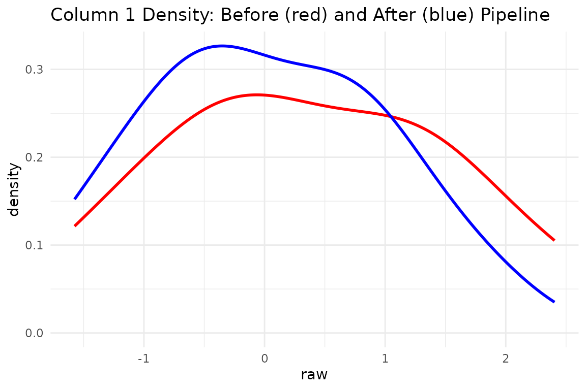

# Pre-processing pipelines in multiblock

## 1. Why a pipeline at all?

Code that mutates data in place (e.g. `scale(X)`) is convenient in a
script but dangerous inside reusable functions:

- **Data-leak avoidance**: Fitted means/SDs live inside the
  pre-processor object, calculated only once (typically on training
  data).
- **Reversibility**:
  [`inverse_transform()`](https://bbuchsbaum.github.io/multivarious/reference/inverse_transform.md)
  gives you proper back-transforms (handy for reconstruction error or
  publication plots).
- **Composability**: You can nest simple steps together (e.g.,
  `colscale(center())`).
- **Partial input**: The same pipeline can process just the columns you
  pass (`transform(..., colind = 1:3)`), perfect for region-of-interest
  or block workflows.

The grammar is tiny:

| Verb                                                                                  | Role                          | Typical Call                  |
|---------------------------------------------------------------------------------------|-------------------------------|-------------------------------|
| [`pass()`](https://bbuchsbaum.github.io/multivarious/reference/pass.md)               | do nothing (placeholder)      | `fit(pass(), X)`              |
| [`center()`](https://bbuchsbaum.github.io/multivarious/reference/center.md)           | subtract column means         | `fit(center(), X)`            |
| [`standardize()`](https://bbuchsbaum.github.io/multivarious/reference/standardize.md) | centre and scale to unit SD   | `fit(standardize(), X)`       |
| [`colscale()`](https://bbuchsbaum.github.io/multivarious/reference/colscale.md)       | user-supplied weights/scaling | `fit(colscale(type="z"), X)`  |
| `...`                                                                                 | (write your own)              | any function returning a node |

The
[`fit()`](https://bbuchsbaum.github.io/multivarious/reference/fit.md)
verb is the bridge between defining your preprocessing steps (the
*recipe*) and actually applying them. You call
[`fit()`](https://bbuchsbaum.github.io/multivarious/reference/fit.md) on
your recipe, providing your training dataset.
[`fit()`](https://bbuchsbaum.github.io/multivarious/reference/fit.md)
calculates and stores the necessary parameters (e.g., column means,
standard deviations) from this data, returning a *fitted pre-processor*
object.

Once you have a fitted preprocessor object, it exposes three key
methods:

| Method                     | Role                                         | Typical Use Case           |
|----------------------------|----------------------------------------------|----------------------------|
| `fit_transform(prep, X)`   | fits parameters *and* transforms `X`         | Training set (convenience) |
| `transform(pp, Xnew)`      | applies stored parameters to new data        | Test/new data              |
| `inverse_transform(pp, Y)` | back-transforms data using stored parameters | Interpreting results       |

## 2. The 60-second tour

### 2.1 No-op and sanity check

``` r
set.seed(0)
X <- matrix(rnorm(10*4), 10, 4)

pp_pass <- fit(pass(), X)        # == do nothing
Xp_pass <- transform(pp_pass, X) # applies nothing, just copies X
all.equal(Xp_pass, X)            # TRUE
#> [1] TRUE
```

### 2.2 Centre → standardise

``` r
# Fit the preprocessor (calculates means & SDs from X) and transform
pp_std <- fit(standardize(), X)
Xs     <- transform(pp_std, X)

# Check results
all(abs(colMeans(Xs)) < 1e-12)   # TRUE: data is centered
#> [1] TRUE
round(apply(Xs, 2, sd), 6)       # ~1: data is scaled
#> [1] 1 1 1 1

# Check back-transform
all.equal(inverse_transform(pp_std, Xs), X) # TRUE
#> [1] TRUE
```

### 2.3 Partial input (region-of-interest)

Imagine a sensor fails and you only observe columns 2 and 4:

``` r
X_cols24 <- X[, c(2,4), drop=FALSE] # Keep as matrix

# Apply the *already fitted* standardizer using only columns 2 & 4
Xs_cols24 <- transform(pp_std, X_cols24, colind = c(2,4))

# Compare original columns 2, 4 with their transformed versions
head(cbind(X_cols24, Xs_cols24))
#>            [,1]       [,2]        [,3]       [,4]
#> [1,]  0.7635935 -0.2357066  1.65874473 -0.5049144
#> [2,] -0.7990092 -0.5428883 -0.64301984 -0.9030207
#> [3,] -1.1476570 -0.4333103 -1.15658932 -0.7610081
#> [4,] -0.2894616 -0.6494716  0.10756045 -1.0411523
#> [5,] -0.2992151  0.7267507  0.09319316  0.7424264
#> [6,] -0.4115108  1.1519118 -0.07222208  1.2934334

# Back-transform works too
X_rev_cols24 <- inverse_transform(pp_std, Xs_cols24, colind = c(2,4))
all.equal(X_rev_cols24, X_cols24) # TRUE
#> [1] TRUE
```

## 3. Composing preprocessing steps

Because preprocessing steps nest, you can build pipelines by composing
them:

``` r
# Define a pipeline: center, then scale to unit variance
# Fit the pipeline to the data
pp_pipe <- fit(standardize(), X)

# Apply the pipeline
Xp_pipe <- transform(pp_pipe, X)
```

### 3.1 Quick visual

``` r
# Compare first column before and after pipeline
df_pipe <- tibble(raw = X[,1],   processed = Xp_pipe[,1])

ggplot(df_pipe) +
  geom_density(aes(raw), colour = "red", linewidth = 1) +
  geom_density(aes(processed), colour = "blue", linewidth = 1) +
  ggtitle("Column 1 Density: Before (red) and After (blue) Pipeline") +
  theme_minimal()
```



## 4. Block-wise concatenation

Large multiblock models often want different preprocessing per block.
[`concat_pre_processors()`](https://bbuchsbaum.github.io/multivarious/reference/concat_pre_processors.md)
glues several *already fitted* pipelines into one wide transformer that
understands global column indices.

``` r
# Two fake blocks with distinct scales
X1 <- matrix(rnorm(10*5 , 10 , 5), 10, 5)   # block 1: high mean
X2 <- matrix(rnorm(10*7 ,  2 , 7), 10, 7)   # block 2: low mean

# Fit separate preprocessors for each block
p1 <- fit(center(), X1)
p2 <- fit(standardize(), X2)

# Transform each block
X1p <- transform(p1, X1)
X2p <- transform(p2, X2)

# Concatenate the *fitted* preprocessors
block_indices_list = list(1:5, 6:12)
pp_concat <- concat_pre_processors(
  list(p1, p2),
  block_indices = block_indices_list
)

# Apply the concatenated preprocessor to the combined data
X_combined <- cbind(X1, X2)
X_combined_p <- transform(pp_concat, X_combined)

# Check means (block 1 only centered, block 2 standardized)
round(colMeans(X_combined_p), 2)
#>  [1] 0 0 0 0 0 0 0 0 0 0 0 0

# Need only block 1 processed later? Use colind with global indices
X1_later_p <- transform(pp_concat, X1, colind = block_indices_list[[1]])
all.equal(X1_later_p, X1p) # TRUE
#> [1] TRUE

# Need block 2 processed?
X2_later_p <- transform(pp_concat, X2, colind = block_indices_list[[2]])
all.equal(X2_later_p, X2p) # TRUE
#> [1] TRUE
```

#### Check reversibility of concatenated pipeline

``` r
back_combined <- inverse_transform(pp_concat, X_combined_p)

# Compare first few rows/cols of original vs round-trip
knitr::kable(
  head(cbind(orig = X_combined[, 1:6], recon = back_combined[, 1:6]), 3),
  digits = 2,
  caption = "First 3 rows, columns 1-6: Original vs Reconstructed"
)
```

|       |       |       |       |       |       |       |       |       |       |       |       |
|------:|------:|------:|------:|------:|------:|------:|------:|------:|------:|------:|------:|
| 18.79 | 11.33 | 11.79 | 10.10 |  6.01 | 11.10 | 18.79 | 11.33 | 11.79 | 10.10 |  6.01 | 11.10 |
| 12.80 |  8.12 |  9.94 | 11.29 | 16.27 | -4.11 | 12.80 |  8.12 |  9.94 | 11.29 | 16.27 | -4.11 |
|  7.74 | 22.21 |  5.30 |  6.75 | 13.86 |  2.06 |  7.74 | 22.21 |  5.30 |  6.75 | 13.86 |  2.06 |

First 3 rows, columns 1-6: Original vs Reconstructed

``` r

all.equal(X_combined, back_combined) # TRUE
#> [1] TRUE
```

## 5. Inside the weeds (for authors & power users)

| Helper                                                                                                    | Purpose                                                                                                                                                                                                                                                                                                    |
|-----------------------------------------------------------------------------------------------------------|------------------------------------------------------------------------------------------------------------------------------------------------------------------------------------------------------------------------------------------------------------------------------------------------------------|
| `fresh(pp)`                                                                                               | return the un-fitted recipe skeleton. **Crucial for tasks like cross-validation (CV)**, as it allows you to re-[`fit()`](https://bbuchsbaum.github.io/multivarious/reference/fit.md) the pipeline using *only* the current training fold’s data, preventing data leakage from other folds or the test set. |
| [`concat_pre_processors()`](https://bbuchsbaum.github.io/multivarious/reference/concat_pre_processors.md) | build one big transformer out of already-fitted pieces.                                                                                                                                                                                                                                                    |
| [`pass()`](https://bbuchsbaum.github.io/multivarious/reference/pass.md) vs `fit(pass(), X)`               | [`pass()`](https://bbuchsbaum.github.io/multivarious/reference/pass.md) is a recipe; `fit(pass(), X)` is a fitted identity transformer.                                                                                                                                                                    |
| caching                                                                                                   | Fitted preprocessor objects store parameters (means, SDs) for fast re-application.                                                                                                                                                                                                                         |

You rarely need to interact with these helpers directly; they exist so
model-writers (e.g. new PCA flavours) can avoid boiler-plate.

## 6. Key take-aways

- **Write once**: Define a preprocessing recipe (e.g.,
  `colscale(center())`) and reuse it safely across CV folds using
  [`fit()`](https://bbuchsbaum.github.io/multivarious/reference/fit.md)
  on each fold’s training data.
- **No data leakage**: Parameters live inside the fitted preprocessor
  object, calculated only from training data.
- **Composable & reversible**: Nest preprocessing steps, extract the
  original recipe with
  [`fresh()`](https://bbuchsbaum.github.io/multivarious/reference/fresh.md),
  and back-transform whenever you need results in original units using
  [`inverse_transform()`](https://bbuchsbaum.github.io/multivarious/reference/inverse_transform.md).
- **Block-aware**: The same mechanism powers multiblock PCA, CCA,
  ComDim…

Happy projecting!

------------------------------------------------------------------------

## Session info

``` r
sessionInfo()
#> R version 4.5.3 (2026-03-11)
#> Platform: x86_64-pc-linux-gnu
#> Running under: Ubuntu 24.04.4 LTS
#> 
#> Matrix products: default
#> BLAS:   /usr/lib/x86_64-linux-gnu/openblas-pthread/libblas.so.3 
#> LAPACK: /usr/lib/x86_64-linux-gnu/openblas-pthread/libopenblasp-r0.3.26.so;  LAPACK version 3.12.0
#> 
#> locale:
#>  [1] LC_CTYPE=C.UTF-8       LC_NUMERIC=C           LC_TIME=C.UTF-8       
#>  [4] LC_COLLATE=C.UTF-8     LC_MONETARY=C.UTF-8    LC_MESSAGES=C.UTF-8   
#>  [7] LC_PAPER=C.UTF-8       LC_NAME=C              LC_ADDRESS=C          
#> [10] LC_TELEPHONE=C         LC_MEASUREMENT=C.UTF-8 LC_IDENTIFICATION=C   
#> 
#> time zone: UTC
#> tzcode source: system (glibc)
#> 
#> attached base packages:
#> [1] stats     graphics  grDevices utils     datasets  methods   base     
#> 
#> other attached packages:
#> [1] ggplot2_4.0.2      tibble_3.3.1       dplyr_1.2.1        multivarious_0.3.1
#> 
#> loaded via a namespace (and not attached):
#>  [1] Matrix_1.7-4       gtable_0.3.6       jsonlite_2.0.0     compiler_4.5.3    
#>  [5] tidyselect_1.2.1   geigen_2.3         jquerylib_0.1.4    systemfonts_1.3.2 
#>  [9] scales_1.4.0       textshaping_1.0.5  yaml_2.3.12        fastmap_1.2.0     
#> [13] lattice_0.22-9     R6_2.6.1           labeling_0.4.3     generics_0.1.4    
#> [17] knitr_1.51         desc_1.4.3         chk_0.10.0         bslib_0.10.0      
#> [21] pillar_1.11.1      RColorBrewer_1.1-3 rlang_1.2.0        cachem_1.1.0      
#> [25] xfun_0.57          fs_2.0.1           sass_0.4.10        S7_0.2.1          
#> [29] cli_3.6.6          pkgdown_2.2.0      withr_3.0.2        magrittr_2.0.5    
#> [33] digest_0.6.39      grid_4.5.3         lifecycle_1.0.5    vctrs_0.7.3       
#> [37] evaluate_1.0.5     glue_1.8.0         farver_2.1.2       ragg_1.5.2        
#> [41] rmarkdown_2.31     matrixStats_1.5.0  tools_4.5.3        pkgconfig_2.0.3   
#> [45] htmltools_0.5.9
```
