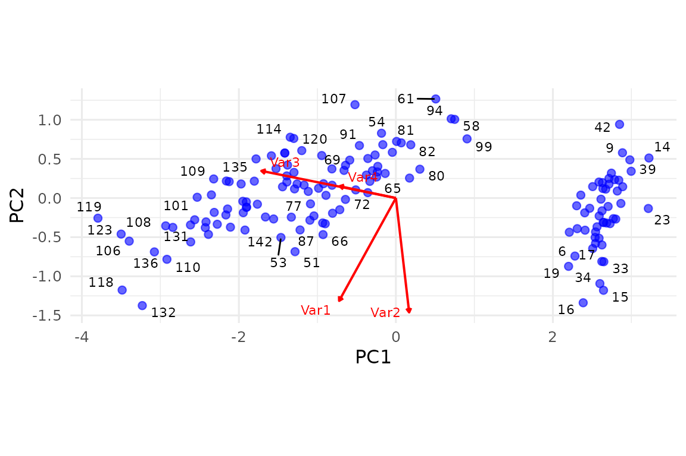

# SVD wrapper, PCA and the bi_projector

## 1. Why wrap SVD at all?

There are six popular SVD engines in R (base::svd, corpcor, RSpectra,
irlba, rsvd, svd (PROPACK)) – each with its own argument list, naming
conventions and edge-cases (some refuse to return the full rank, others
crash on tall-skinny matrices).

[`svd_wrapper()`](https://bbuchsbaum.github.io/multivarious/reference/svd_wrapper.md)
smooths that out:

- identical call-signature no matter the backend,
- automatic pre-processing (centre / standardise) via the same pipeline
  interface shown in the previous vignette,
- returns a `bi_projector` – an S3 class that stores loadings `v`,
  scores `s`, singular values `sdev` plus the fitted pre-processor.

That means immediate access to verbs such as
[`project()`](https://bbuchsbaum.github.io/multivarious/reference/project.md),
[`reconstruct()`](https://bbuchsbaum.github.io/multivarious/reference/reconstruct.md),
[`truncate()`](https://bbuchsbaum.github.io/multivarious/reference/truncate.md),
[`partial_project()`](https://bbuchsbaum.github.io/multivarious/reference/partial_project.md).

``` r
set.seed(1)
X <- matrix(rnorm(35*10), 35, 10)   # 35 obs × 10 vars

sv_fast <- svd_wrapper(X, ncomp = 5, preproc = center(), method = "fast")

# irlba backend (if installed) gives identical results
sv_irlba <- if (requireNamespace("irlba", quietly = TRUE)) {
  suppressWarnings(svd_wrapper(X, ncomp = 5, preproc = center(), method = "irlba"))
}

# Same downstream code works for both objects:
head(scores(sv_fast)) # 35 × 5
#>            [,1]       [,2]       [,3]        [,4]        [,5]
#> [1,] -2.9415181 -1.6140167  0.2117456  0.12109736 -0.46419317
#> [2,]  0.4743086  0.3458298 -0.8467096 -1.21167498  0.02074819
#> [3,] -1.6999172 -1.1535717 -1.0276227 -0.33535843  0.37155930
#> [4,]  0.1131790  0.7789166 -0.7394153  0.43625966  2.24260205
#> [5,]  0.8437314 -1.7600608 -0.8939140  0.77861595  0.81936957
#> [6,]  0.6063990 -1.8810077  1.2246519  0.03652504 -1.40433408

if (!is.null(sv_irlba)) {
  all.equal(scores(sv_fast), scores(sv_irlba))
}
#> [1] "Mean relative difference: 0.7895446"
```

## 2. A one-liner `pca()`

Most people really want PCA, so
[`pca()`](https://bbuchsbaum.github.io/multivarious/reference/pca.md) is
a thin wrapper that

1.  calls
    [`svd_wrapper()`](https://bbuchsbaum.github.io/multivarious/reference/svd_wrapper.md)
    with sane defaults,
2.  adds the S3 class “pca” (printing, screeplot, biplot, permutation
    test, …).

``` r
data(iris)
X_iris <- as.matrix(iris[, 1:4])

pca_fit <- pca(X_iris, ncomp = 4)    # defaults to method = "fast", preproc=center()
print(pca_fit)
#> PCA object  -- derived from SVD
#> 
#> Data: 150 observations x 4 variables
#> Components retained: 4
#> 
#> Variance explained (per component):
#>  1 2 3 4  92.46  5.31  1.71  0.52%  (cumulative:  92.46 97.77 99.48   100%)
```

### 2.1 Scree-plot and cumulative variance

``` r
screeplot(pca_fit, type = "lines", main = "Iris PCA – scree plot")
```


### 2.2 Quick biplot

``` r
# Requires ggrepel for repulsion, but works without it
biplot(pca_fit, repel_points = TRUE, repel_vars = TRUE)
```



(If you do not have ggrepel installed the text is placed without
repulsion.)

## 3. What is a `bi_projector`?

Think bidirectional mapping:

    data space  (p variables)  ↔  component space  (d ≤ p)
            new samples:  project()        ← scores
           new variables: project_vars()   ← loadings
                         reconstruction ↔  (scores %*% t(loadings))

A `bi_projector` therefore carries

| slot      | shape | description                                         |
|-----------|-------|-----------------------------------------------------|
| `v`       | p × d | component loadings (columns)                        |
| `s`       | n × d | score matrix (rows = observations)                  |
| `sdev`    | d     | singular values (or SDs related to components)      |
| `preproc` | –     | fitted transformer so you never leak training stats |

Because
[`pca()`](https://bbuchsbaum.github.io/multivarious/reference/pca.md)
returns a `bi_projector`, you get other methods for free:

``` r
# rank-2 reconstruction of the iris data
Xhat2 <- reconstruct(pca_fit, comp = 1:2)
print(paste("MSE (rank 2):", round(mean((X_iris - Xhat2)^2), 4))) # MSE ~ 0.076
#> [1] "MSE (rank 2): 0.0253"

# drop to 2 PCs everywhere
pca2 <- truncate(pca_fit, 2)
shape(pca2)            # 4 vars × 2 comps
#> [1] 4 2
```

## 4. Fast code-coverage cameo

The next chunk quietly touches a few more branches used in the unit
tests
([`std_scores()`](https://bbuchsbaum.github.io/multivarious/reference/std_scores.md),
[`perm_test()`](https://bbuchsbaum.github.io/multivarious/reference/perm_test.md),
[`rotate()`](https://bbuchsbaum.github.io/multivarious/reference/rotate.md)),
but keeps printing to a minimum:

``` r
# std scores
head(std_scores(svd_wrapper(X, ncomp = 3))) # Use the earlier X data
#>            [,1]       [,2]         [,3]
#> [1,] -2.1517996 -1.2898029 -0.009068656
#> [2,]  0.2706758  0.3540074 -0.658705409
#> [3,] -1.3315759 -0.7788579 -1.206524820
#> [4,] -0.0595748  0.7971995 -0.971493443
#> [5,]  0.5035052 -1.2105838 -1.291893170
#> [6,]  0.4441909 -1.5304768  0.866038002

# tiny permutation test (10 perms; obviously too few for science)
# This requires perm_test.pca method
# Make sure X_iris is centered if perm_test needs centered data
perm_res <- perm_test(pca_fit, X_iris, nperm = 10, comps = 2)
#> Pre-calculating reconstructions for stepwise testing...
#> Running 10 permutations sequentially for up to 2 PCA components (alpha=0.050, serial)...
#>   Testing Component 1/2...
#>   Component 1 p-value (0.09091) > alpha (0.050). Stopping sequential testing.
print(perm_res$component_results)
#> # A tibble: 1 × 5
#>    comp observed   pval lower_ci upper_ci
#>   <int>    <dbl>  <dbl>    <dbl>    <dbl>
#> 1     1    0.925 0.0909    0.682    0.689

# quick varimax rotation
if (requireNamespace("GPArotation", quietly = TRUE)) {
  pca_rotated <- rotate(pca_fit, ncomp = 3, type = "varimax")
  print(pca_rotated)
} else {
  cat("GPArotation not installed, skipping rotation example.\n")
}
#> PCA object  -- derived from SVD
#> 
#> Data: 150 observations x 4 variables
#> Components retained: 4
#> 
#> Variance explained (per component):
#>  1 2 3 4  46.56  3.92  5.68 43.84%  (cumulative:  46.56 50.48 56.16   100%)
#> 
#> Explained variance from rotation:
#> 82.9 %
#>  6.98 %
#>  10.12 %
#>  
#> 
#> Rotation details:
#>   Type: varimax 
#>   Loadings type: N/A (orthogonal)
```

(Running these once in the vignette means they are also executed by
`R CMD check`, bumping test-coverage without extra scaffolding.)

## 5. Take-aways

- [`svd_wrapper()`](https://bbuchsbaum.github.io/multivarious/reference/svd_wrapper.md)
  gives you a unified front end to half-a-dozen SVD engines.
- [`pca()`](https://bbuchsbaum.github.io/multivarious/reference/pca.md)
  piggy-backs on that, returning a fully featured `bi_projector`.
- The `bi_projector` contract means the same verbs & plotting utilities
  work for any decomposition you wrap into the framework later.

------------------------------------------------------------------------

## Session info

``` r
sessionInfo()
#> R version 4.5.3 (2026-03-11)
#> Platform: x86_64-pc-linux-gnu
#> Running under: Ubuntu 24.04.4 LTS
#> 
#> Matrix products: default
#> BLAS:   /usr/lib/x86_64-linux-gnu/openblas-pthread/libblas.so.3 
#> LAPACK: /usr/lib/x86_64-linux-gnu/openblas-pthread/libopenblasp-r0.3.26.so;  LAPACK version 3.12.0
#> 
#> locale:
#>  [1] LC_CTYPE=C.UTF-8       LC_NUMERIC=C           LC_TIME=C.UTF-8       
#>  [4] LC_COLLATE=C.UTF-8     LC_MONETARY=C.UTF-8    LC_MESSAGES=C.UTF-8   
#>  [7] LC_PAPER=C.UTF-8       LC_NAME=C              LC_ADDRESS=C          
#> [10] LC_TELEPHONE=C         LC_MEASUREMENT=C.UTF-8 LC_IDENTIFICATION=C   
#> 
#> time zone: UTC
#> tzcode source: system (glibc)
#> 
#> attached base packages:
#> [1] stats     graphics  grDevices utils     datasets  methods   base     
#> 
#> other attached packages:
#> [1] ggplot2_4.0.3      multivarious_0.3.1
#> 
#> loaded via a namespace (and not attached):
#>  [1] Matrix_1.7-4         gtable_0.3.6         jsonlite_2.0.0      
#>  [4] dplyr_1.2.1          compiler_4.5.3       Rcpp_1.1.1-1        
#>  [7] tidyselect_1.2.1     geigen_2.3           jquerylib_0.1.4     
#> [10] systemfonts_1.3.2    scales_1.4.0         textshaping_1.0.5   
#> [13] yaml_2.3.12          fastmap_1.2.0        lattice_0.22-9      
#> [16] R6_2.6.1             labeling_0.4.3       generics_0.1.4      
#> [19] knitr_1.51           ggrepel_0.9.8        tibble_3.3.1        
#> [22] desc_1.4.3           chk_0.10.0           bslib_0.10.0        
#> [25] pillar_1.11.1        RColorBrewer_1.1-3   rlang_1.2.0         
#> [28] cachem_1.1.0         xfun_0.57            fs_2.1.0            
#> [31] sass_0.4.10          S7_0.2.2             cli_3.6.6           
#> [34] pkgdown_2.2.0        withr_3.0.2          magrittr_2.0.5      
#> [37] digest_0.6.39        grid_4.5.3           irlba_2.3.7         
#> [40] lifecycle_1.0.5      vctrs_0.7.3          evaluate_1.0.5      
#> [43] glue_1.8.1           GPArotation_2025.3-1 corpcor_1.6.10      
#> [46] farver_2.1.2         ragg_1.5.2           rmarkdown_2.31      
#> [49] tools_4.5.3          pkgconfig_2.0.3      htmltools_0.5.9
```
