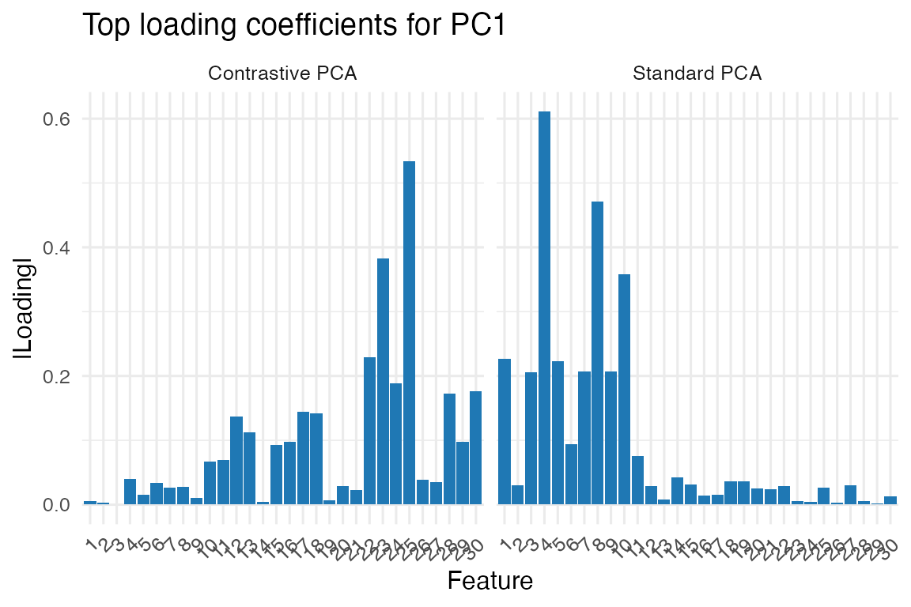

# Contrastive PCA: Finding What's Different Between Groups

## What is Contrastive PCA?

Imagine you’re studying two groups: patients with a disease and healthy
controls. Both groups show variation in their measurements, but you’re
specifically interested in what makes the patients *different*. Standard
PCA would find the largest sources of variation across all samples,
which might be dominated by age, sex, or other factors common to both
groups.

**Contrastive PCA (cPCA++) finds patterns that are enriched in one group
(foreground) compared to another (background).**

## A Simple Example

Let’s start with a practical example to see why contrastive PCA is
useful:

``` r
set.seed(123)
n_samples <- 100
n_features <- 50

# Create background data (e.g., healthy controls)
# Main variation is in features 1-10
background <- matrix(rnorm(n_samples * n_features), n_samples, n_features)
background[, 1:10] <- background[, 1:10] * 3  # Strong common variation

# Create foreground data (e.g., patients)
# Has the same common variation PLUS disease-specific signal in features 20-25
foreground <- background[1:60, ]  # Start with same structure
foreground[, 20:25] <- foreground[, 20:25] + matrix(rnorm(60 * 6, sd = 2), 60, 6)

# Standard PCA on combined data
all_data <- rbind(background, foreground)
regular_pca <- pca(all_data, ncomp = 2)

# Contrastive PCA
cpca_result <- cPCAplus(X_f = foreground, X_b = background, ncomp = 2)
#> Using feature-space strategy...

# Compare what each method finds
loadings_df <- rbind(
  data.frame(
    feature = factor(1:30),
    value   = abs(regular_pca$v[1:30, 1]),
    method  = "Standard PCA"
  ),
  data.frame(
    feature = factor(1:30),
    value   = abs(cpca_result$v[1:30, 1]),
    method  = "Contrastive PCA"
  )
)

ggplot(loadings_df, aes(x = feature, y = value)) +
  geom_col(fill = "#1f78b4") +
  facet_wrap(~method, nrow = 1) +
  theme_minimal(base_size = 12) +
  theme(axis.text.x = element_text(angle = 45, hjust = 1)) +
  labs(
    x = "Feature",
    y = "|Loading|",
    title = "Top loading coefficients for PC1"
  )
```



Notice how standard PCA focuses on features 1-10 (the common variation),
while contrastive PCA correctly identifies features 20-25 (the
group-specific signal).

## Using cPCAplus()

The
[`cPCAplus()`](https://bbuchsbaum.github.io/multivarious/reference/cPCAplus.md)
function makes contrastive PCA easy to use:

``` r
# Basic usage
cpca_fit <- cPCAplus(
  X_f = foreground,  # Your group of interest (foreground)
  X_b = background,  # Your reference group (background)
  ncomp = 5          # Number of components to extract
)
#> Using feature-space strategy...

# The result is a bi_projector object with familiar methods
print(cpca_fit)
#> A bi_projector object with the following properties:
#> 
#> Dimensions of the weights (v) matrix:
#>   Rows:  50  Columns:  5 
#> 
#> Dimensions of the scores (s) matrix:
#>   Rows:  60  Columns:  5 
#> 
#> Length of the standard deviations (sdev) vector:
#>   Length:  5 
#> 
#> Preprocessing information:
#> A finalized pre-processing pipeline:
#>  Step 1: center

# Project new data
new_samples <- matrix(rnorm(10 * n_features), 10, n_features)
new_scores <- project(cpca_fit, new_samples)

# Reconstruct using top components
reconstructed <- reconstruct(cpca_fit, comp = 1:2)
```

## Understanding the Output

[`cPCAplus()`](https://bbuchsbaum.github.io/multivarious/reference/cPCAplus.md)
returns a `bi_projector` object containing:

- **`v`**: Loadings (feature weights) for each component
- **`s`**: Scores (sample projections) for the foreground data
- **`sdev`**: Standard deviations explaining the “contrastive variance”
- **`values`**: The eigenvalue ratios (foreground variance / background
  variance)

``` r
# Which features contribute most to the first contrastive component?
top_features <- order(abs(cpca_fit$v[, 1]), decreasing = TRUE)[1:10]
print(paste("Top contributing features:", paste(top_features, collapse = ", ")))
#> [1] "Top contributing features: 25, 23, 42, 32, 22, 24, 50, 30, 28, 33"

# How much more variable is each component in foreground vs background?
print(paste("Variance ratios:", paste(round(cpca_fit$values[1:3], 2), collapse = ", ")))
#> [1] "Variance ratios: 16.74, 13.31, 10.31"
```

## Common Applications

### 1. Biomedical Studies

``` r
# Identify disease-specific patterns
tumor_cpca <- cPCAplus(
  X_f = tumor_samples,
  X_b = healthy_tissue,
  ncomp = 10
)
```

### 2. Technical Variation Removal

``` r
# Use technical replicates as background to find biological signal
bio_cpca <- cPCAplus(
  X_f = biological_samples,
  X_b = technical_replicates,
  ncomp = 5
)
```

### 3. Time-Based Contrasts

``` r
# Find patterns specific to treatment timepoint
treatment_cpca <- cPCAplus(
  X_f = after_treatment,
  X_b = before_treatment,
  ncomp = 5
)
```

## Advanced Options

### Handling High-Dimensional Data

When you have more features than samples (p \>\> n), use the efficient
sample-space strategy:

``` r
# Create high-dimensional example
n_f <- 50; n_b <- 80; p <- 1000
X_background_hd <- matrix(rnorm(n_b * p), n_b, p)
X_foreground_hd <- X_background_hd[1:n_f, ] + 
                   matrix(c(rnorm(n_f * 20, sd = 2), rep(0, n_f * (p-20))), n_f, p)

# Use sample-space strategy for efficiency
cpca_hd <- cPCAplus(X_f = X_foreground_hd, X_b = X_background_hd,
                    ncomp = 5, strategy = "sample")
#> Using sample-space strategy...
#> Warning in irlba::irlba(X_b_centered, nv = r_target, nu = 0): You're computing
#> too large a percentage of total singular values, use a standard svd instead.
```

### Regularization for Unstable Background

If your background covariance is nearly singular, add regularization:

``` r
# Small background sample size can lead to instability
small_background <- matrix(rnorm(20 * 100), 20, 100)
small_foreground <- matrix(rnorm(30 * 100), 30, 100)

# Add regularization
cpca_regularized <- cPCAplus(
  X_f = small_foreground,
  X_b = small_background,
  ncomp = 5,
  lambda = 0.1  # Regularization parameter for background covariance
)
#> Using feature-space strategy...
```

## When to Use Contrastive PCA

✓ **Use contrastive PCA when:** - You have two groups and want to find
patterns specific to one - Background variation obscures your signal of
interest - You want to remove technical/batch effects captured by
control samples

✗ **Don’t use contrastive PCA when:** - You only have one group (use
standard PCA) - Groups differ mainly in mean levels (use t-tests or
LDA) - The interesting variation is non-linear (consider kernel methods)

## Technical Details

Click for mathematical details

Contrastive PCA++ solves the generalized eigenvalue problem:

``` math
\mathbf{R}_f \mathbf{v} = \lambda \mathbf{R}_b \mathbf{v}
```

where: - $`\mathbf{R}_f`$ is the foreground covariance matrix -
$`\mathbf{R}_b`$ is the background covariance matrix - $`\lambda`$
represents the variance ratio (foreground/background) - $`\mathbf{v}`$
are the contrastive directions

This finds directions that maximize the ratio of foreground to
background variance, effectively highlighting patterns enriched in the
foreground group.

The
[`geneig()`](https://bbuchsbaum.github.io/multivarious/reference/geneig.md)
function provides the underlying solver with multiple algorithm
options: - `"geigen"`: General purpose, handles non-symmetric matrices -
`"robust"`: Fast for well-conditioned problems - `"primme"`: Efficient
for very large sparse matrices

## References

- Abid, A., Zhang, M. J., Bagaria, V. K., & Zou, J. (2018). Exploring
  patterns enriched in a dataset with contrastive principal component
  analysis. *Nature Communications*, 9(1), 2134.

- Salloum, R., & Kuo, C. C. J. (2022). cPCA++: An efficient method for
  contrastive feature learning. *Pattern Recognition*, 124, 108378.

- Wu, M., Sun, Q., & Yang, Y. (2025). PCA++: How Uniformity Induces
  Robustness to Background Noise in Contrastive Learning. *arXiv
  preprint arXiv:2511.12278*.

- Woller, J. P., Menrath, D., & Gharabaghi, A. (2025). Generalized
  contrastive PCA is equivalent to generalized eigendecomposition. *PLOS
  Computational Biology*, 21(10), e1013555.

## See Also

- [`pca()`](https://bbuchsbaum.github.io/multivarious/reference/pca.md)
  for standard principal component analysis
- [`discriminant_projector()`](https://bbuchsbaum.github.io/multivarious/reference/discriminant_projector.md)
  for supervised dimensionality reduction
- [`geneig()`](https://bbuchsbaum.github.io/multivarious/reference/geneig.md)
  for solving generalized eigenvalue problems directly
